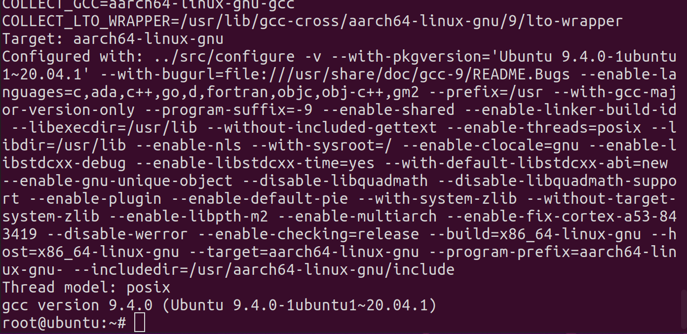
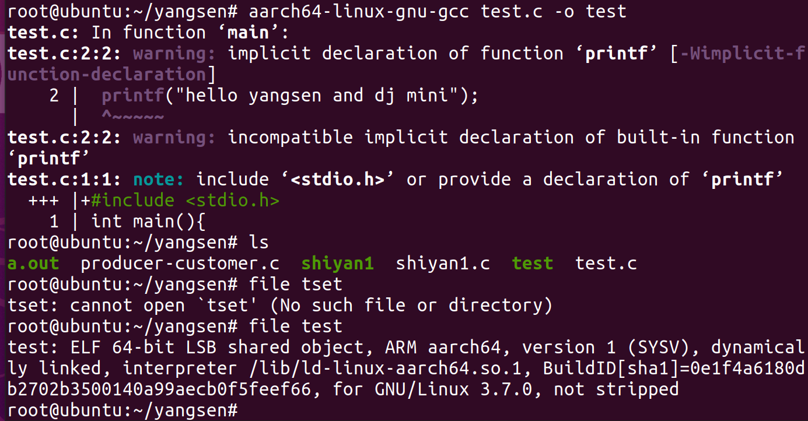
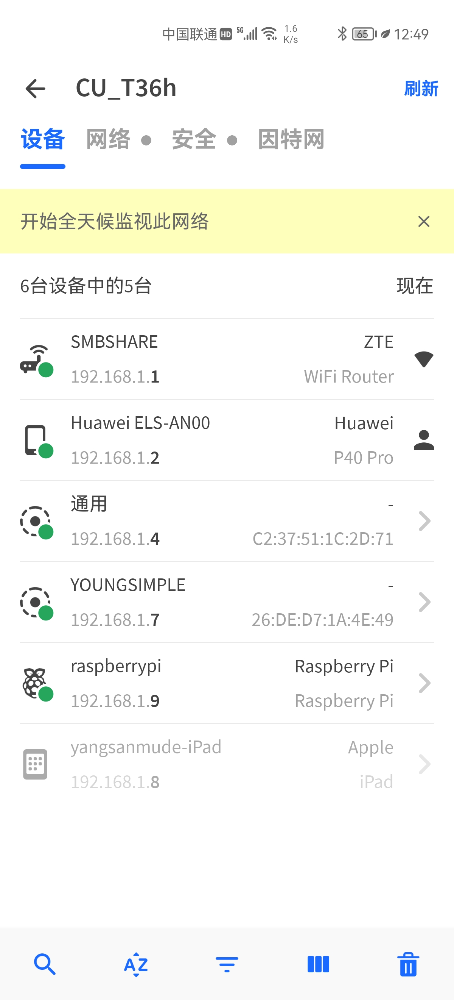
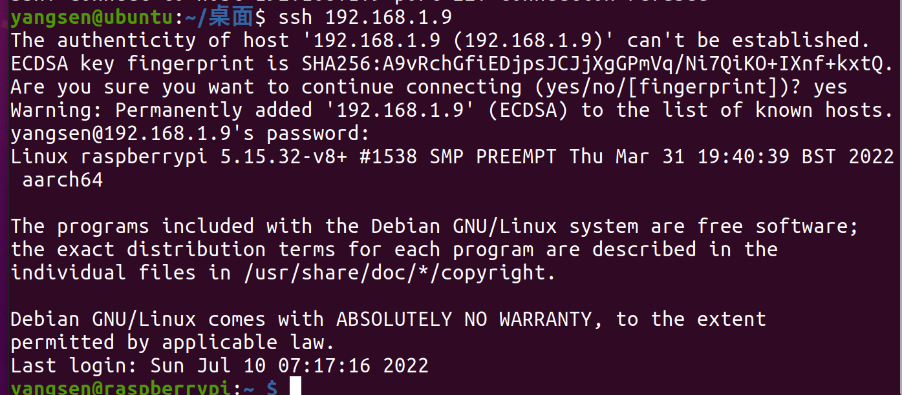
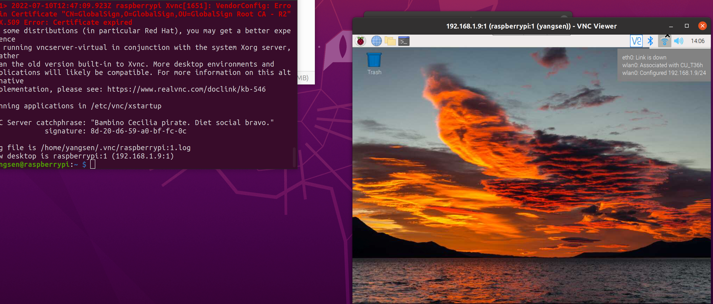
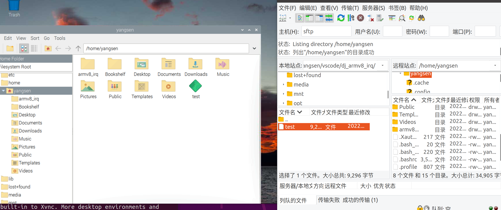
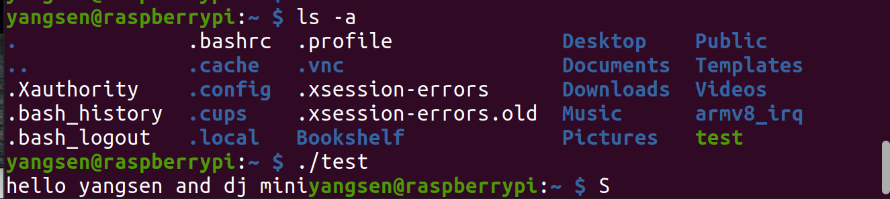
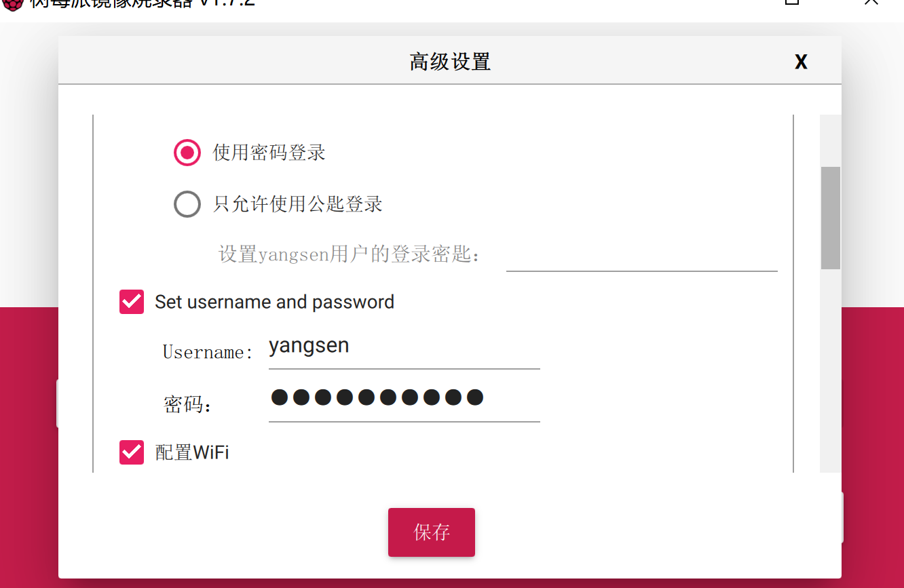

# 操作 
## 部署Linux pc 
在网上下载ubuntu系统，在VMware中创建ubunt虚拟机。
## 交叉编译工具链
概念：平时我们用的编译器都是将程序编译成能在我们主机上运行的2进制码，交叉编译工具 
将程序编译成能在对应的嵌入式目标机上运行的2进制码。本次要在Linux pc机上安装armv8的 交叉编译工具aarch64-linux-gnu-gcc

1. 使用命令```apt-cache search aarch64``` 查询对应的版本，选择gcc-10-aarch64-linux-gnu - GNU C compiler (cross compiler for arm64 architecture) 版本
2. 使用命令```apt install gcc-aarch64-linux-gnu```安装相适应应版本。 
3. 安装后，使用```aarch64-linux-gnu-gcc -v```检查时配置是否成功。 
4. pc机配置结果 
 
 5. 测试使用```aarch64-linux-gnu-gcc test.c -o test```
   这里的警告应该是和arm实验课上学的那样，暂时不支持软中断。
## 树莓派设置
1. 购买TF卡和读卡器，在树莓派官网下载arm64位的树莓派系统镜像。
2. 使用raspberry pi image程序将镜像烧写入TF卡。（不要点格式化）
3. 在boot目录下新建ssh无后缀文件。
4. 在boot模式下新建wpa_supplicant.json文件，并在其中写入网路连接配置。（文件在当前目录下）
5. TF卡插入树莓派，接通电源启动。
6. 用手机软件fing找到树莓派IP地址准备使用ssh登录。 
   
7. 根据得到的IP地址ssh登录树莓派```ssh 192.168.1.x```
   
8. 启用VNC 先看树莓派的VNC是否启用使用```sudo raspi-config```打开树莓派的配置，先找interface选项进入，找到vnc并启用；在树莓派控制台输入```vncserver```打开树莓派VNC，成功的话会给出一个如图的IP：port；在PC端的realvnc viewer输入改IP和端口号，就能使用VNC界面。想关闭改VNC使用```vncserver -kill:端口号```
9. 文件传输。想把主机上的文件传输给树莓派有多种方法，有一个非常好用的软件filezilla，输入好树莓派IP和端口号，选择sftp传输协议，即可传输文件。
   


# 问题
## 在网络上某些网站下载资源很慢甚至下不了
   1. 通过F12检查网页，点击右半屏左上角的箭头，点击网页中的下载按钮，找到下载链接，复制链接到网盘下载。
## 不知道是不是因为不会翻墙，gcc-cross的网站打不开
   1. 直接在pc机上使用apt安装编译工具
## 给树莓派连接wifi时，想省麻烦，在boot区编写一个用于连接wifi的json文件，但是Linux上使用arp -a一直扫描不到树莓派的IP
1. 好像，应该，大概是我用win32Disk写入系统后，软件提示是否格式化，我点了格式化，导致隐藏空间的系统被擦除了
## 原本想将全部操作放在ubuntu上进行，但是使用dd工具时，一直没反应，就改用了在windows下写入树莓派系统。
1. 原本是使用按网上win32Disk进行树莓派镜像烧写，但不知道是这个树莓派之前被别人用过的缘故还是默认账户已经被取消了（应该是第二个，毕竟新系统），默认用户名和密码无法ssh登录，后来查找资料决定使用raspberry pi image烧写，并设置用户名和密码。 
   

## 有时树莓派关了之后再登会发现原本能用的配置都用不了，比如在写入镜像的时候配置的WiFi登录json文件和ssh登录文件，都用不了
1. 这应该是不正确关闭树莓派导致的，这时候需要重新将TF卡卸下，重新配置。
## 在安装过程中还遇到一个比较扯淡的问题，安装软件时一直报错：已安装mysql-server-8.0 软件包post-installation 
这是因为我之前学习时想在ubuntu上下载mysql，结果没下完，也挡到了其他软件下载的路，需要重新卸载，安装。可以使用下面的命令组  
```sudo mv /var/lib/dpkg/info /var/lib/dpkg/info_old;sudo mkdir /var/lib/dpkg/info;sudo apt-get update;sudo apt-get -f install;sudo mv /var/lib/dpkg/info/* /var/lib/dpkg/info_old;sudo rm -r /var/lib/dpkg/info;sudo mv /var/lib/dpkg/info_old /var/lib/dpkg/info;