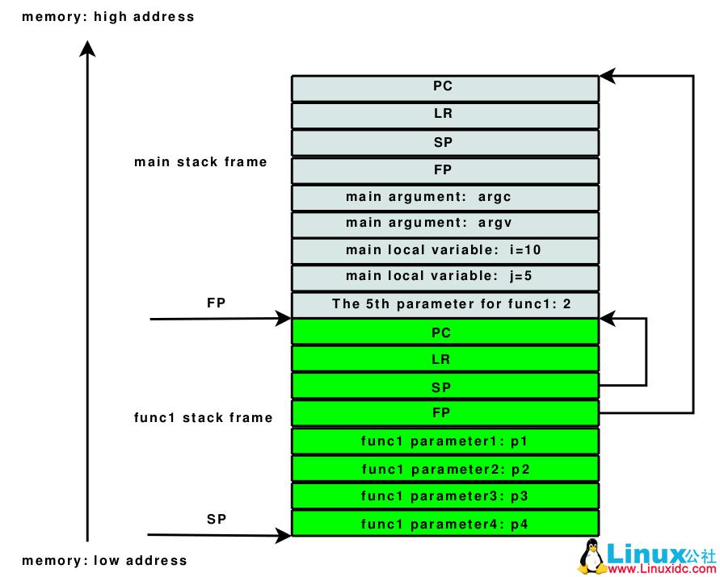

**一个进程总会拥有自己的内存空间，这些内存可被分为5类**
1. 代码段（程序执行部分），进程必须拥有该段的可读权，但不一定非要有该段的可写权
2. 只读静态数据
3. 可写静态数据
4. 堆
5. 栈
   
- 可写静态数据可以进一步分为已初始化数据，未初始化数据和默认值初始化数据
- 进程只能执行被设计用来存放代码的内存空间中的指令
- 除了栈，其他任何一个段都不需要整个占据内存中一个连续的内存区域
- 一个进程运行必须拥有代码段和栈，其他的不一定
- 堆是由进程管理的内存区域。常用于创建动态数据单元
  
## 内存地址
1. 地址空间可以由一个或多个不相交的区域组成。任何区域都不能跨越地址零（尽管只有一个区域可能从零开始）
2. 指针可以有标记寻址和非标记寻址，第一种在64位指针的前八位指明地址的计算方式，将后56位送入地址转换系统。第二种直接将64位送入地址转换系统
## 栈
与armv9不同的是，armv8的栈只有“满减”栈这一种，常用于存放本地数据以及在调用子例程且参数大于8个时传递参数，同时，栈的最小操作单元是4字128位。即：栈顶 < sp <= 栈底,且sp mod 16 = 0
## 帧指针
stack我们都知道，每一个进程都有自己的栈。考虑进程执行时发生函数调用的场景，母函数和子函数使用的是同一个栈，在通常的情况下，我们并不需要区分母函数和子函数分别使用了栈的哪个部分。但是，当我们需要在执行过程中对函数调用进行backtrace的时候，这一信息就很重要了。
简单的说，stack frame就是一个函数所使用的stack的一部分，所有函数的stack frame串起来就组成了一个完整的栈。stack frame的两个边界分别由FP和SP来限定。 fp执向栈帧底 

在程序执行过程中（通常是发生了某种意外情况而需要进行调试），通过SP和FP所限定的stack frame，就可以得到母函数的SP和FP，从而得到母函数的stack frame（PC，LR，SP，FP会在函数调用的第一时间压栈，这里入栈的SP和FP标明调用者函数的栈帧，包括主函数），以此追溯，即可得到所有函数的调用顺序。
  
而在armv8架构中，图中每一个都是64位