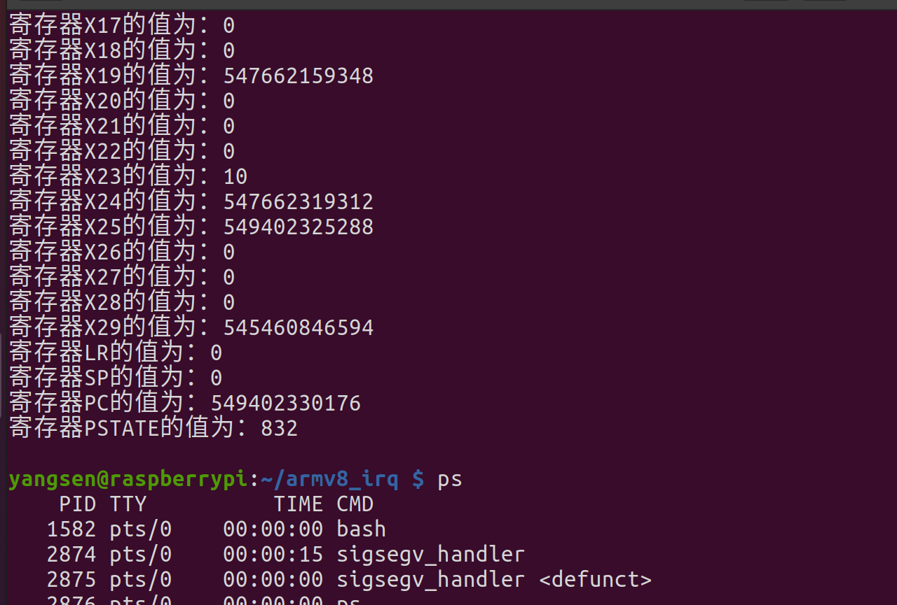

1. 在第一次尝试中，我使用内嵌汇编在发生sigsegv指令前修改寄存器的值，用于检验信号处理函数。
``` 
asm volatile(
            "mov x0, #0\n"
            "mov x1, #1\n"
            "mov x2, #2\n"
            "mov x3, #3\n"
            "mov x4, #4\n"
            "mov x16, #16\n"
            "mov x17, #17\n"
            :
            :
            :"memory"
        );
```  
但是检验结果很不正确，如下（10进制）
2. 按照内核对异常的处理流程，sp中正应该存储pt_regs结构的异常现场啊？于是猜想，是不是调用信号处理函数，形成的栈帧导致sp再次向下增长。于是我将回溯栈的内联汇编代码的sp改成fp，结果还是一样，应该是我对内核数据异常的处理有没弄明白的地方。
```
    for(int i = 0; i < 30; i++){
    	long reg;

        asm volatile(
            "mov x7, #8\n"
            "mul w7, %w1, w7\n"
            "ldr %0, [fp, x7]\n"

            : "=r" (reg)
            : "r" (i)
            : "memory"
        );

        printf("寄存器X%d的值为：0x%lx\n", i, reg);
    }

    long lr, sp, pc, cpsr;

    asm volatile(
        "ldr %0, [fp, # 240]\n"
        "ldr %1, [fp, #248]\n"
        "ldr %2, [fp, #256]\n"
        "ldr %3, [fp, #264]\n"
        :"=r"(lr), "=r"(sp), "=r"(pc), "=r"(cpsr)
        :
        :"memory"
    );

    printf("寄存器LR的值为：0x%lx\n", lr);
    printf("寄存器SP的值为：0x%lx\n", sp);
    printf("寄存器PC的值为：0x%lx\n", pc);
    printf("寄存器PSTATE的值为：0x%lx\n", cpsr);
    exit(0);
```