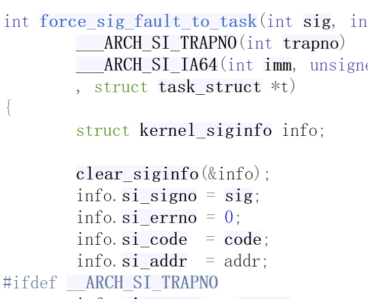

### 思路1
能不能对内核进行修改，让其在发生sigsegv异常进行异常处理时将pt_regs的地址作为信号信息传入进程内的信号处理函数，信号处理函数可以根据此信息通过内嵌汇编将异常现场输出。问题是，怎么修改内核，或者让内核的异常处理程序使用我自己编写的函数？  
  
  这个想法其实是读源码是发现这个：
    
  如果将这个addr在前面的函数中偷换成异常现场的pt_regs，输出异常现场很简单。
### 思路2
异常发生后使用都是sp_el1，异常现场的保存和自己编写的信号处理函数应该都是使用的sp_el1指向的栈空间。 

能不能根据栈帧结构不断向上进行回溯，找到保存的异常现场。问题是，我怎么判断，回溯到哪一步正好是保存异常现场的栈空间？

### 问题
一直以为信号处理函数在运行时是处在el1使用sp_el1,然而好像并不是。
  
同时在发生访存异常时,处理器硬件会在存储完pc和pstate后自动将sp选择为sp_el1，之后内核对异常进行处理，所以异常现场保存在sp_el1指向的栈空间里  
#### 原因
我的理解是：信号处理函数实际上是在异常发生后硬件，内核异常处理结束后返回用户态调用的，内核发出信号，信号处理函数接受才进行的处理。如果没有自己编写的信号处理函数，则进行默认的处理

### 指导
1. 寄存器不重要，重要的是它的内容，即使异常使得sp在不断改变，只要知道内核对其保存的地方，得到其内容，再结合栈回溯，得到类似GDB bt指令的值。
2. 先自己手动实现gdb bt栈回溯功能，再与异常现场结合
3. 使用高级版的sigaction信号处理函数，其void * context参数保留有我想知道的异常现场的信息