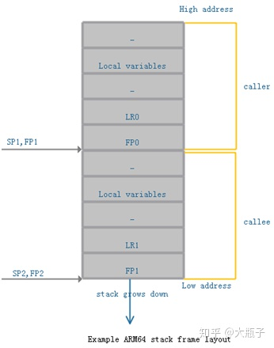
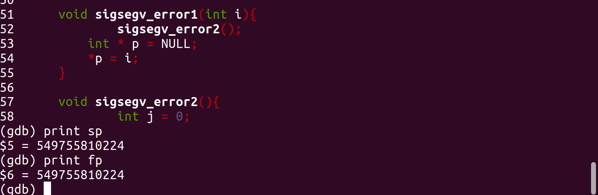
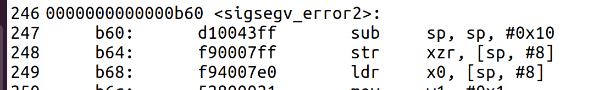
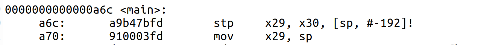

**该篇说明为sigsegv异常时异常现场和栈回溯成熟思路的代码实现说明**
# 异常现场（异常时的处理机上下文获取）
## 为什么要先获取异常现场
在对arm64体系的栈帧结构进行了解后，我计划使用基于fp的栈帧回溯进行栈回溯，在此之前，需要先获得异常函数的fp寄存器中存储的地址，再据此进行异常的栈回溯（如果栈没有被破坏的话）
## 思路 
1. 在高级的信号处理函数编程中，信号处理函数有三个参数，其中第三个参数（void *）是一个指向ucontext_t结构体的指针，具体在头文件<sys/ucontext.h>中定义如下  
```
/* 用于描述处理机状态的内容 */
typedef struct
  {
    unsigned long long int __ctx(fault_address);
    unsigned long long int __ctx(regs)[31];
    unsigned long long int __ctx(sp);
    unsigned long long int __ctx(pc);
    unsigned long long int __ctx(pstate);
    /* This field contains extension records for additional processor
       state such as the FP/SIMD state.  It has to match the definition
       of the corresponding field in the sigcontext struct, see the
       arch/arm64/include/uapi/asm/sigcontext.h linux header for details.  */
    unsigned char __reserved[4096] __attribute__ ((__aligned__ (16)));
  } mcontext_t;

/* 用户层的上下文 */
typedef struct ucontext_t
  {
    unsigned long __ctx(uc_flags);
    struct ucontext_t *uc_link;
    stack_t uc_stack;
    sigset_t uc_sigmask;
    mcontext_t uc_mcontext;
  } ucontext_t;
  ```  
  其中的成员uc_mcontext是一个mcontext_t类型的结构体，该结构体中包含了arm64位体系中异常现场的寄存器值，通过该结构体，就能轻松输出异常现场并根据对应寄存器的值进行异常现场的栈回溯。  

2. 具体异常现场输出的代码如下  
```
   ucontext_t * p = (ucontext_t *)context;       
for(int i = 0; i < 30; i++){
        printf("寄存器X%d的值为：0x%llx\n", i, p->uc_mcontext.regs[i]);
    }

    printf("寄存器LR的值为：0x%llx\n", p->uc_mcontext.regs[30]);
    printf("寄存器SP的值为：0x%llx\n", p->uc_mcontext.sp);
    printf("寄存器PC的值为：0x%llx\n", p->uc_mcontext.pc);
    printf("寄存器PSTATE的值为：0x%llx\n", p->uc_mcontext.pstate);
    printf("error address：0x%llx\n", p->uc_mcontext.fault_address);  
```
3. 结果  
     
   各个进行验证的寄存器的值都符合预期结果
# 异常栈回溯
## 实现原理
### 基于fp的栈帧回溯
1. 根据arm64位体系的栈帧结构如下：   
  
每次函数调用时，被调用函数都会将父函数的栈顶（子函数的栈底）和在父函数的返回地址存入子函数栈空间的栈顶，并将fp寄存器中的值更新为子函数栈顶，通过此栈帧结构和异常现场的sp和fp寄存器的值，可以一步步向上回溯每个函数的栈空间。
2. 需要注意的是，对于在程序执行过程中最后一个调用的函数，其lr和fp的值由于不会再改变，不会再入栈。需要对这种情况有所考虑。

   
### 由bl指令编码得到子函数地址。
1. 由子函数的fp寄存器我们可以通过读取内存得到异常函数的返回地址lr。（对于没有栈帧的函数，其lr寄存器中就存有返回地址）
2. 由于a64的编码为32位，且返回地址指向函数调用的吓一跳指令，我们将lr减去4就得到了调用异常函数的bl指令的地址。
3. bl指令是相对寻址，编码格式是低26位为偏移地址的四分之一，算出具体偏移地址在与pc（lr - 4）相加便可得到函数的入口地址。
4. 在信号处理函数中对每个函数，将其函数地址与函数名称建立起字典地对应关系，再由3中得到的地址找出函数名称，便于结果输出。具体定义如下：  
```
#define NUM 5
//函数名和其地址建立对应关系的结构体

typedef struct symtab_e{
    void  * fun_addr;
    char name[20];
}symtab_e;
```
```
	symtab_e symtab[NUM] = {
		{main, "main()"},
		{sigsegv_error1, "sigsegv_error1()"},
		{sig_handler, "sig_handler()"},
		{sigsegv_error2, "sigsegv_error2()"},
		{func1, "func1()"}
	};
```

## 结果
1. 异常函数有栈帧时其fp = sp    
  
结果为：


2. 异常函数无栈帧时fp > sp
  
  
结果如下  
  
  
可以看到输出的栈回溯结果中main函数的fp与其子函数func1的fp相差正好0xb0 = 192，与汇编代码符合，算是对栈回溯成功的一个验证

## 问题与解决
1. 在对异常函数无栈帧的情况进行验证和研究时，发现一直出错，栈现场被破环掉导致回溯时出现访存错误。  
  
解决：在编译时加入-fstack-protector-all选项  
2. 在栈回溯结束时我原想将程序跳转到异常函数的返回地址继续执行，代码如下  
```
	asm(
	"mov x1,%0\n"
	"br x1\n"
	:
	:"r"(ret)
	:
	);
```
但发现虽然能接着从父函数继续执行，父函数却无法继续返回。  
  
解决：暂无
## 缺陷
1. 对于blr指令，（如main函数地调用，毫无办法）
2. 无法精确输出函数调用以及问题出现对应的源文件行数
3. 没有对进程死循环进行检测与处理